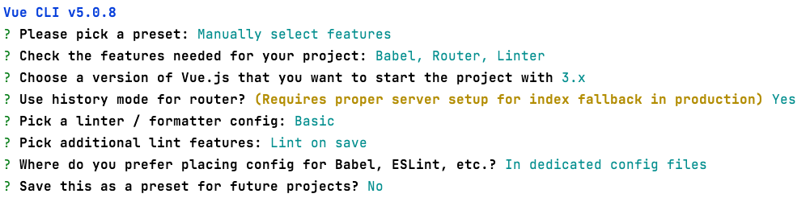

# SPA App на Go и VueJS   

Пример SPA приложения на Go и VueJS.

Файлы ui собираются в `ui/dist` и после с помощью [embed](https://pkg.go.dev/embed) отдается как статика Go сервером

После сборки будут доступны сдедующие ручки

| Endpoint              | Execute       |  Method       |
| --------              | -------       | -------       |
| /                     | Vue Router    | Get           |              
| /about                | Vue Router    | Get           |
| /api/v1/greeting/     | Golang Mux    | Get           |

## Конфигурация Vue


# Разработка

Dev сервер для разработки go (По умолчанию 8000 порт)
```shell
go run ./...
```

Dev сервер для разработки Vue (По умолчанию 8888 порт)
```shell
cd ui
npm run serve
```


# Локальный запуск

Собираем web в директории `ui/dist` - которую втроили как ФС в Go приложение
```shell
cd ui
npm run build
```

Запускаем
```shell
cd ..
go run ./...
```

# Docker

1. Собираем фронтенд
```shell
cd ui
npm run build
```

2. Компилируем
```shell
docker build -t go-spa:demo .
```

3. (Опционально) Удаляем старые имаджы
```shell
docker image prune -f
```

4. Запускаем SPA контейнер
```shell
docker run --rm -p "8888:8888" go-spa:demo
```
